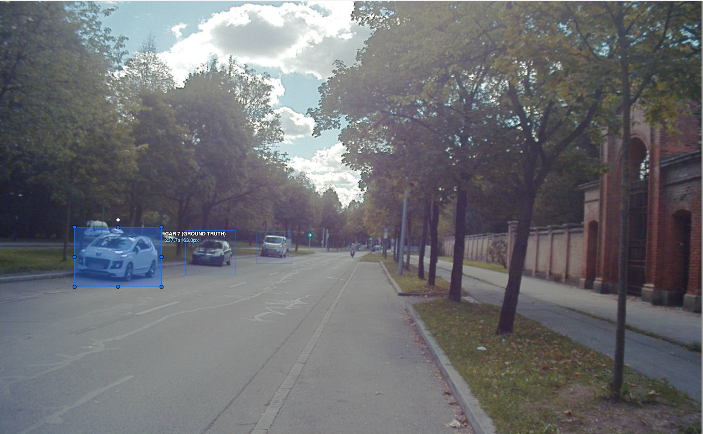
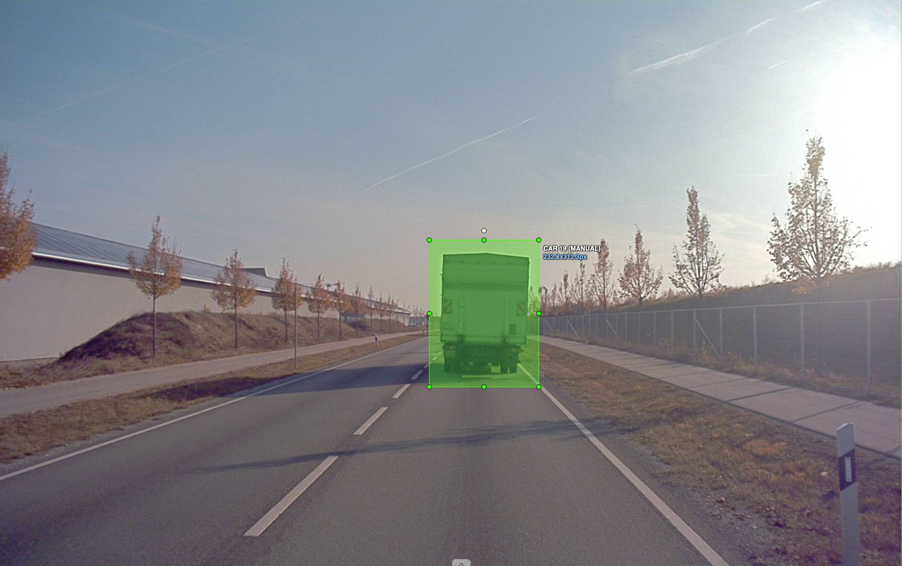
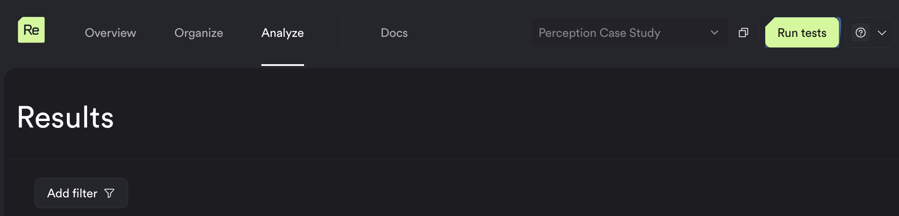
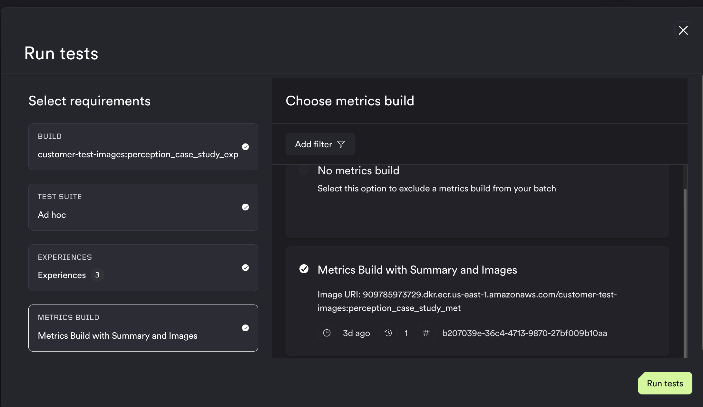
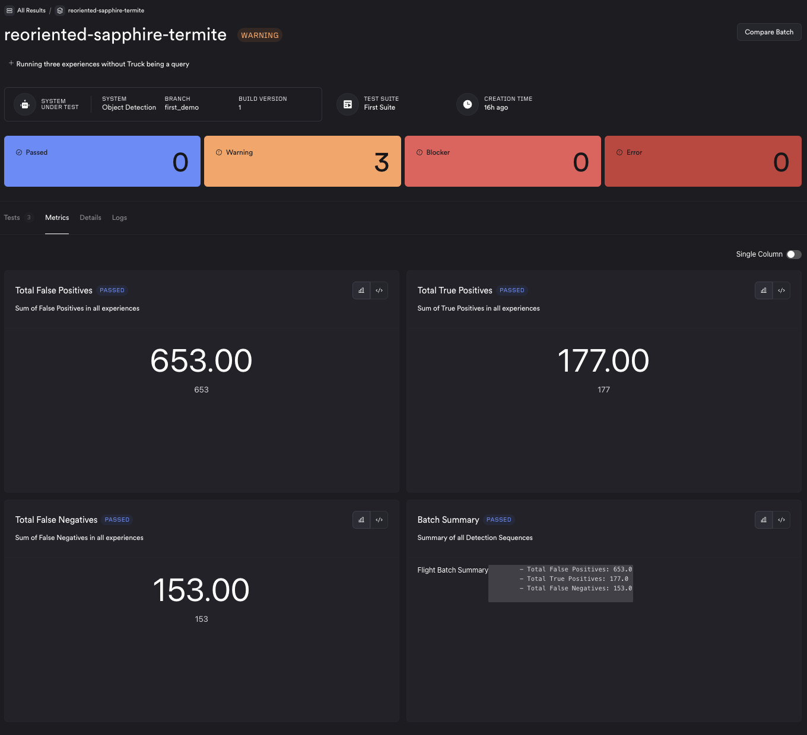
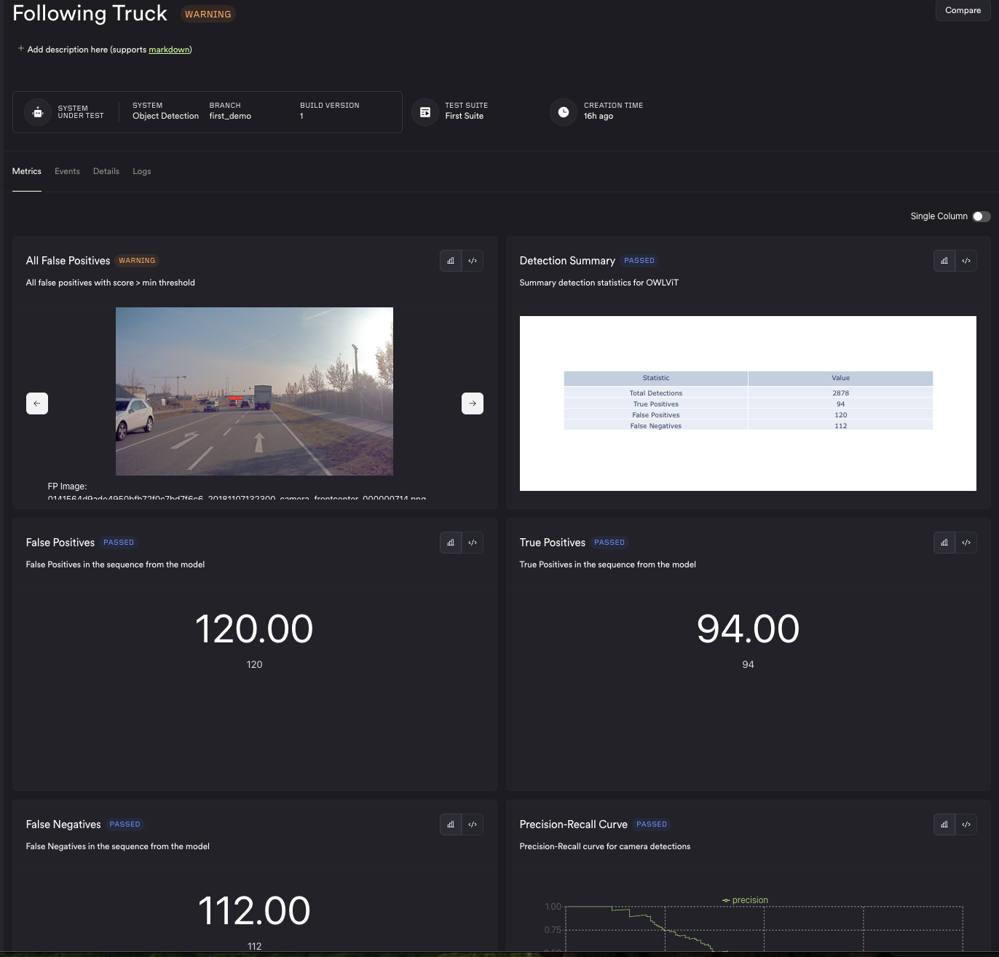
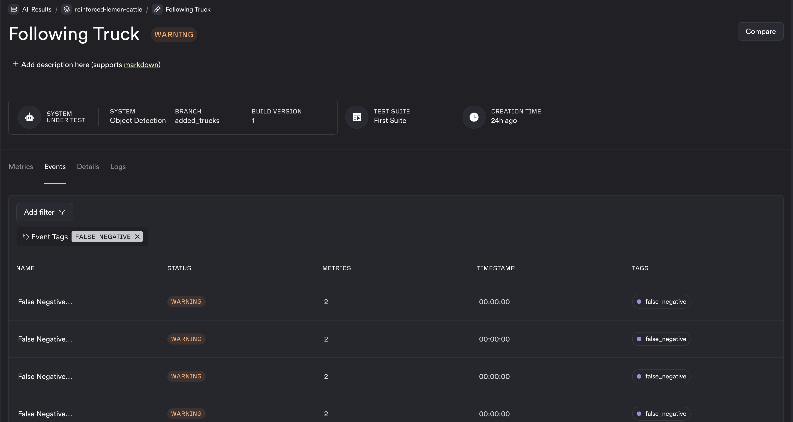
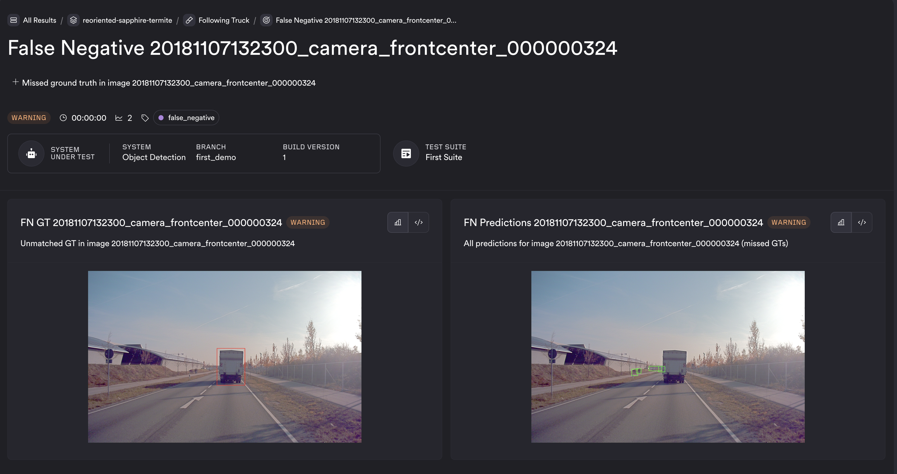
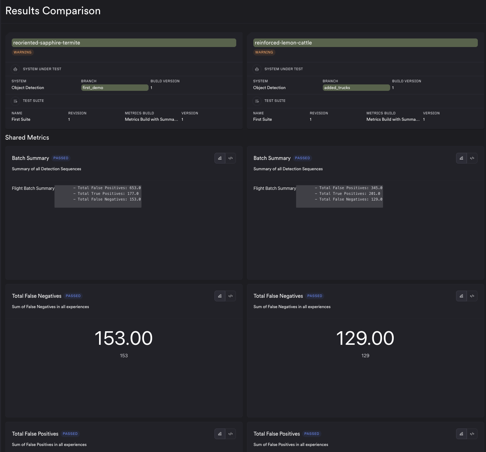

# Perception Case Study - Analyzing Object Detection System using ReSim
The perception module of an autonomy system is responsible for taking sensor inputs and reasoning where objects are in space and where the ego vehicle/robot is relative to these objects. Camera is a primary sensor for perception stacks for maany autonomous systems as they provide rich RGB information about the world. Deep learning models are trained using a comprehensive dataset of images to make inference from camera data while the robot is operating in its application. 

## Object Detection

An Object Detection system is responsible for detecting: 
1. Presence of an object of interest in the scene
2. Location of the object in the image with the help of bounding boxes (see image below)

Training these AI models require following a comprehensive pipeline of curating specialized datasets, training different models, evaluating trained models with test data sets. Also in application, the robot can evaluate new situations, in which case, new cases (images) are rapidly added to both the training dataset and testing dataset. 

## ReSim 
Evaluation of these datasets require repeated metrics calculations and curating and analyzing visualizations for different versions of these models. [ReSim](https://app.resim.ai) is a cloud simulation testing and analysis platform curated specifically for robotic applications, and is a natural fit for evaluating perception systems like object detection, as it is purpose-built for simulating, testing, and analyzing robotic behavior at scale.

It provides cloud testing infrastructure at scale, which allows the developer to easily test thousands of images with the click of a button on the cloud, and visualize results with well curated metrics and visualizations. It allows easy additions to test cases, visualizations, as well as has tools to test parameters, and compare versions. This blog will show the evaluation of Object Detection using the ReSim platform. 

### Step 0 - Dataset Curation
We will be using a subset of the [Audi A2D2 Autonomous Driving dataset](https://www.a2d2.audi/). A sample 10 images for testing locally will be provided in the sandbox repository. This dataset contains different scenes (urban driving image above), highway driving following truck, among others. . The ground truth annotations include the following:
- What objects are in the scene (class label)
- bounding box rectangles in pixel coordinates showing their location

The ground truth annotaions and the images are added to S3 with the required access, and become the [inputs to the Experience stage](https://docs.resim.ai/setup/adding-experiences/). 

### Step 1 - Experience Build
The experience stage is running the model on the images on inputs. the code for this will be found in the `sandbox/systems/perception/experience` folder. We will be running [OWL VIT model](https://huggingface.co/docs/transformers/en/model_doc/owlvit) which is a general purpose model that can take queries of objects (in this case - cars, trucks) and detect those objects in images. The code for running the model and detecting objects is dockerized and [forms the experience build](https://docs.resim.ai/setup/build-images/). This is uploaded to an ECR and given the necessary access, so ReSim can extract and run in the cloud.  

### Step 2 - Metrics Build
This is the code for evaluation of models. In our case, we will look at simple evaluation metrics such as :
- number of False Positives
- number of False Negatives
- Precision Recall Curve

The actual list of metrics required to evaluate these models is much higher than the list above. The purpose is only to show the use case. The code for calculating these metrics can be found in `sandbox/systems/perception/metrics` folder in the sandbox repository. This code is similarly dockerized and pushed to an ECR and forms the [metrics-build](https://docs.resim.ai/setup/metrics-builds/).

### Step 3 - Registering with ReSim
The substep before running includes using the Resim CLI to register the experience files in S3, the experience build and metrics build in ECR to Resim. Check the [Getting Started Docs](https://docs.resim.ai/setup/) for more info. 

Once this is done, you can optionally create Test Suites (grouping experiences and metrics evaluation). But post this step, you are ready to run your tests on the cloud. 

### Step 4 - Running the Test
The steps moving forward are fortunately very simple. All you need to do to run the test is, go to [ReSim Web App](https://app.resim.ai/), navigate to your project on the top right, and hit Run Tests.

 This opens a popup as shown below. Select the experience build, test suite (or) experiences (in this case sequences) and the metrics evaluation build to run, hit Run Tests and step back and wait, while the model evaluation and analysis is run on the cloud. 
 

 ### Step 5 - Checking results
 Once the results are ready, you can see batch page, which contains a summary of all the tests that ran and categorize them based on passing criteria. In our case, we had 3 tests run, and all had warnings because of the presence of False Positives and False Negatives. The metrics you see on the batch run (`reoriented-sapphire-termite` is the name of the specific test run), are aggregated across tests, and these metrics are called **Batch Metrics**. In this case, they are total false positives, false negatives across tests.
 

Click on the tests tab on the batch, to look at results from separate tests. Now one of the tests in this batch is called `Following Truck`, which contains images from a sequence of the ego vehicle following a truck in a highway. You would be able to see metrics from the results of the model running the input camera images. In this case, we added a list of images, which are false positives, the Precision Recall Curve, among other metrics. 
 

 #### Events
 An event is another mechanism for visualizing specific data. In our case, we have two types of events : 
 - False Negatives
 - False Positives

 Filtering for only false negatives, we get a screen like below: 
 

Visualizing these events can provide a picture of how the model could be underperforming. In this case, you can see the unmatched ground truth was the truck, and the right image showing all detections not include the truck. 

 ### Step 6 - Changing Model 
When tuning models, there are many knobs that can be moved to change the performance. In our simple case, we are just going to change the threshold, and add Truck as a query in our general purpose model in the experience stage, build the docker container with the new setup, push to ECR, Connect it to resim using the CLI, and run the test. 

### A/B compare
Now that the new model is created, we can re-run a test with the new version, and once done, directly compare the runs between two versions to get a side by side comparison of results between two versions, on both the batch level and the test level

From the comparison view, we can see improved performance of the model, because  with the changes, and hence can conclude there were improvements. On a similar vein, we could also detect regressions. 

## Conclusion
In this doc, we went over how we could use resim to analyze a model, perform tweaks and check for improvement/regression as compared to the original version. Our customers use it as part of their Continuous Integration Nightly runs to ensure they flag regressions, as well as extensively in their development to tune and test their models in scale. 
